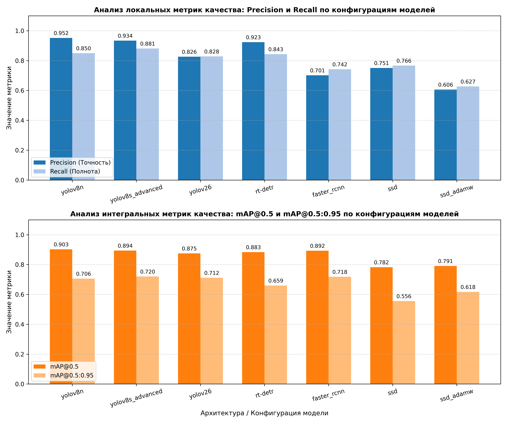

# Сравнительный анализ архитектур нейронных сетей для задачи детекции дорожных знаков

## 1. Структура проекта

* [configs/](configs/) — Конфигурационные файлы проекта
  * [default.yaml](configs/default.yaml) — Глобальные гиперпараметры обучения
* [data/](data/) — Наборы данных
  * [processed/](data/processed/) — Предобработанные тензоры
  * [raw/](data/raw/) — Исходные изображения и YOLO-разметка
* [notebooks/](notebooks/) — Исследовательские блокноты
  * [exploration.ipynb](notebooks/exploration.ipynb) — Разведочный анализ данных (EDA)
* [results/](results/) — Артефакты вычислительных экспериментов
  * [faster_rcnn_experiment/](results/faster_rcnn_experiment/) — Логи Faster R-CNN
  * [rt-detr_experiment/](results/rt-detr_experiment/) —  Логи и метрики RT-DETR
  * [ssd_adamw_experiment/](results/ssd_adamw_experiment/) — Логи SSD на оптимизаторе AdamW
  * [ssd_experiment/](results/ssd_experiment/) — Логи SSD (SGD)
  * [visualizations/](results/visualizations/) — Визуализации
  * [yolov26_experiment/](results/yolov26_experiment/) — Логи и метрики модели YOLOv26
  * [yolov8_advanced_experiment/](results/yolov8_advanced_experiment/) — Логи и метрики улучшенной YOLOv8s
  * [yolov8_experiment/](results/yolov8_experiment/) — Логи и метрики базовой YOLOv8n
  * [model_comparison_leaderboard.csv](results/model_comparison_leaderboard.csv) — Сводная таблица
* [src/](src/) — Исходный код модулей системы
  * [dataset/](src/dataset/) — Скрипты загрузки и аугментации данных
  * [evaluation/](src/evaluation/) — Расчет метрик детекции
  * [models/](src/models/) — Инициализация слоев и бэкбонов
  * [training/](src/training/) — Кастомные циклы обучения PyTorch
  * [utils/](src/utils/) — Вспомогательные утилиты отрисовки рамок
* [main.py](main.py) — Единая точка входа для запуска экспериментов
* [.gitignore](.gitignore)


---

## 2. Результаты вычислительных экспериментов

В ходе выполнения работы были обучены и протестированы различные конфигурации Single-Stage (SSD, YOLO, RT-DETR) и Two-Stage (Faster R-CNN) детекторов. Итоговые метрики качества на валидационной выборке зафиксированы в сводной таблице:

| Model | mAP@0.5 | mAP@0.5:0.95 | Precision | Recall |
| :--- | :---: | :---: | :---: | :---: |
| yolov8n | 0.9026 | 0.7055 | 0.9520 | 0.8500 |
| yolov8s_advanced | 0.8940 | 0.7200 | 0.9340 | 0.8810 |
| faster_rcnn | 0.8924 | 0.7182 | 0.7011 | 0.7421 |
| rt-detr | 0.8833 | 0.6593 | 0.9234 | 0.8433 |
| yolov26 | 0.8747 | 0.7118 | 0.8263 | 0.8281 |
| ssd_adamw | 0.7907 | 0.6175 | 0.6062 | 0.6267 |
| ssd | 0.7822 | 0.5556 | 0.7509 | 0.7665 |

### Визуализация сравнения моделей


---

## 3. Инструкция по запуску проекта

### 3.1. Клонирование репозитория и переход в рабочую директорию
```
git clone https://github.com/Kidomone/cv-project.git
cd cv-project
```

### 3.2. Установка зависимостей
```
pip install -r requirements.txt
```

### 3.3. Подготовка данных:
Загрузка датасета в директории data/raw/

### 3.4. Запуск обучения:
```
python main.py --model yolov8
```

### Разведочный анализ данных (EDA)
Для проверки распределения классов дорожных знаков в выборке и верификации корректности наложения Bounding Boxes по относительным координатам используется Jupyter-ноутбук:
```
jupyter notebook notebooks/exploration.ipynb
```
